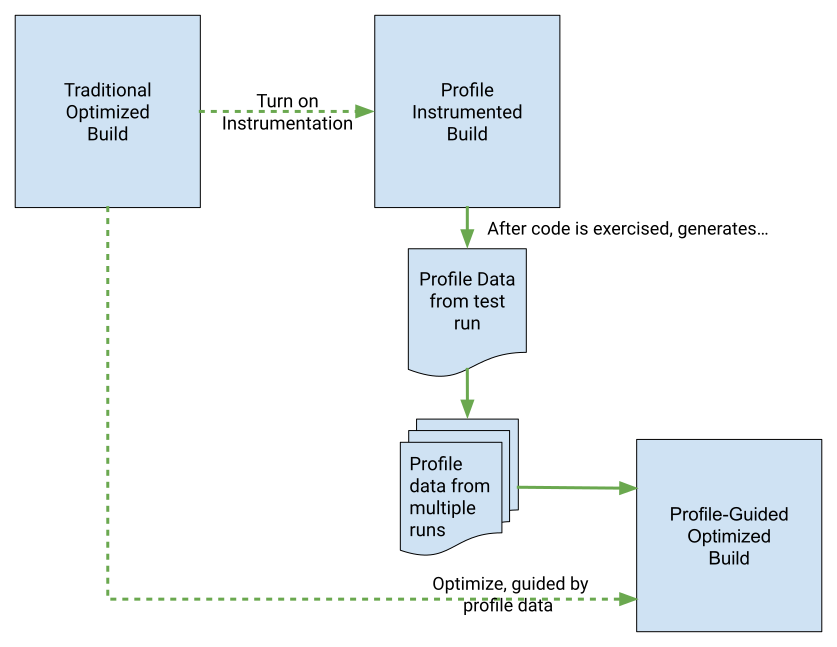

# LTO + PGO

This project demonstrates and compares the effects of Link Time Optimization (LTO) and Profile-Guided Optimization (PGO) on C++ application performance. It provides example code, build scripts, and benchmarks to illustrate how these compiler techniques can improve execution speed and binary size.

## LTO

Link Time Optimization (`LTO`) is a compiler technique that performs optimizations across the entire program at link time, rather than on a per-file basis during compilation. This allows the compiler to make better decisions by having a global view of the code, leading to more aggressive optimizations like inlining and dead code elimination across different compilation units. This often results in a smaller and faster executable.

To enable LTO, for example with Clang++, add the `-flto` flag to both the compilation and linking steps, for example:

```shell
clang++ -O3 -flto main.cpp helper.cpp -o program
```

In CMake, try:

```CMake
include(CheckIPOSupported)
check_ipo_supported(RESULT result)
if(result)
    message(STATUS "LTO/IPO is supported. Enabling it.")
    set(CMAKE_INTERPROCEDURAL_OPTIMIZATION TRUE)
else()
    message(WARNING "LTO/IPO is not supported by the compiler.")
endif()
```

> [!NOTE]  
> Clang provides the ThinLTO `-flto=thin` with faster builds but less optimizations, GCC and Clang provide `-flto=auto`, which tells the compiler to automatically determine the optimal number of LTO jobs. MSVC provides the `/GL` compile and `/LTCG` link flags to enable LTO.

## PGO

Profile-Guided Optimization (`PGO`) is a compiler optimization technique that uses information from a sample run of the program to guide subsequent compilations. The process involves compiling the program with special instrumentation, running it with typical workloads to generate a profile, and then recompiling it a second time using the generated profile data. This allows the compiler to make highly informed decisions on how to optimize the most frequently executed parts of the code, such as function hot paths, leading to significant performance improvements for common use cases.

The process is two-step:



Image taken from: <https://developer.android.com/games/agde/pgo-overview>.

1. Instrument the code using the `-fprofile-instr-generate`:

    ```shell
    clang++ -O3 -fprofile-instr-generate program.cpp -o program_pgo
    ```

2. Run the instrumented executable in a production-like environment (with representative data) to generate the profile data:

    ```shell
    LLVM_PROFILE_FILE="profiles/output.profraw" ./program_pgo
    ```

3. Use `llvm-profdata` to merge profiles from multiple runs:

    ```shell
    llvm-profdata merge -o profiles/merged.profdata profiles/
    ```

4. Re-compile using the generated profile for optimization:

    ```shell
    clang++ -O3 -fprofile-instr-use=profiles/merged.profdata program.cpp -o program
    ```

> [!TIP]  
> You can check if application is instrumented by checking if binary contains expected symbols: `nm build_pgo/app | grep __llvm_profile`.

## Example

Check the code in the `example/` directory and examine the `CMakeLists.txt` file, then run:

```shell
./run_build.sh
```

Finally run the benchmark to see the results:

```shell
./run_benchmark.sh
```

Example output:

```text
=== Running build_baseline/app ===
Total execution time: 246ms, result = 199999990000000
Total execution time: 246ms, result = 199999990000000
Total execution time: 247ms, result = 199999990000000

=== Running build_pgo/app ===
Total execution time: 247ms, result = 199999990000000
Total execution time: 245ms, result = 199999990000000
Total execution time: 246ms, result = 199999990000000

=== Running build_lto/app ===
Total execution time: 140ms, result = 199999990000000
Total execution time: 140ms, result = 199999990000000
Total execution time: 145ms, result = 199999990000000

=== Running build_lto_pgo/app ===
Total execution time: 126ms, result = 199999990000000
Total execution time: 126ms, result = 199999990000000
Total execution time: 127ms, result = 199999990000000
```

## AutoFDO

AutoFDO (Automatic Feedback-Directed Optimization) is a profile-guided optimization technique that uses hardware-generated performance profiles, such as those collected with `perf`, to guide compiler optimizations. This approach allows you to optimize your program based on real-world execution data without requiring instrumentation and multiple compilation steps.

```shell
clang++ -O2 -g program.cpp -o program
perf record -b ./program
create_llvm_prof --binary=./program --out=program.perf
clang++ -O2 -g -fprofile=sample-use=program.perf program.cpp -o program
```

For more information, see this [presentation](https://youtu.be/ADLIxC-WeMw?t=1500).
